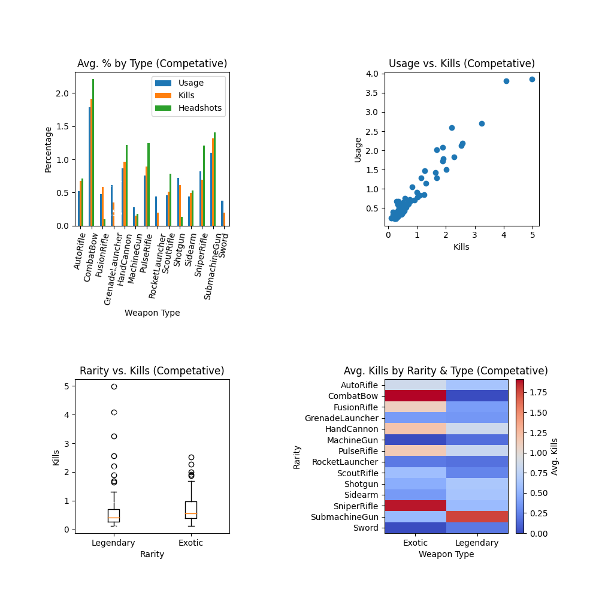
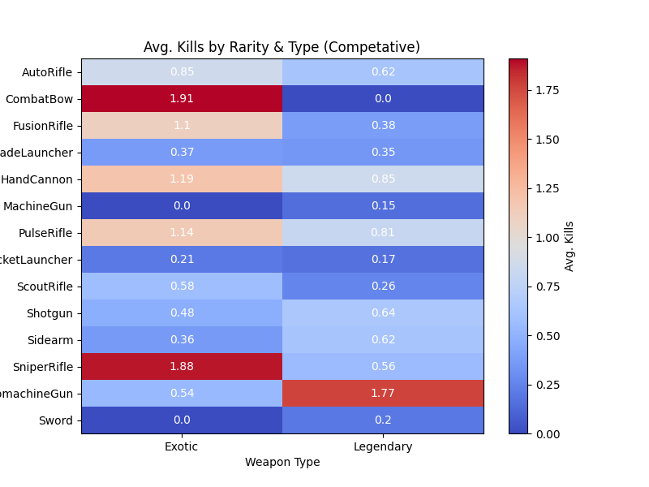
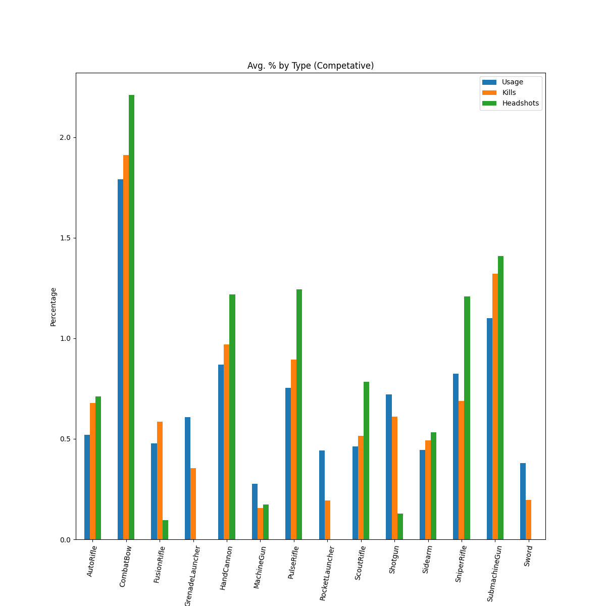
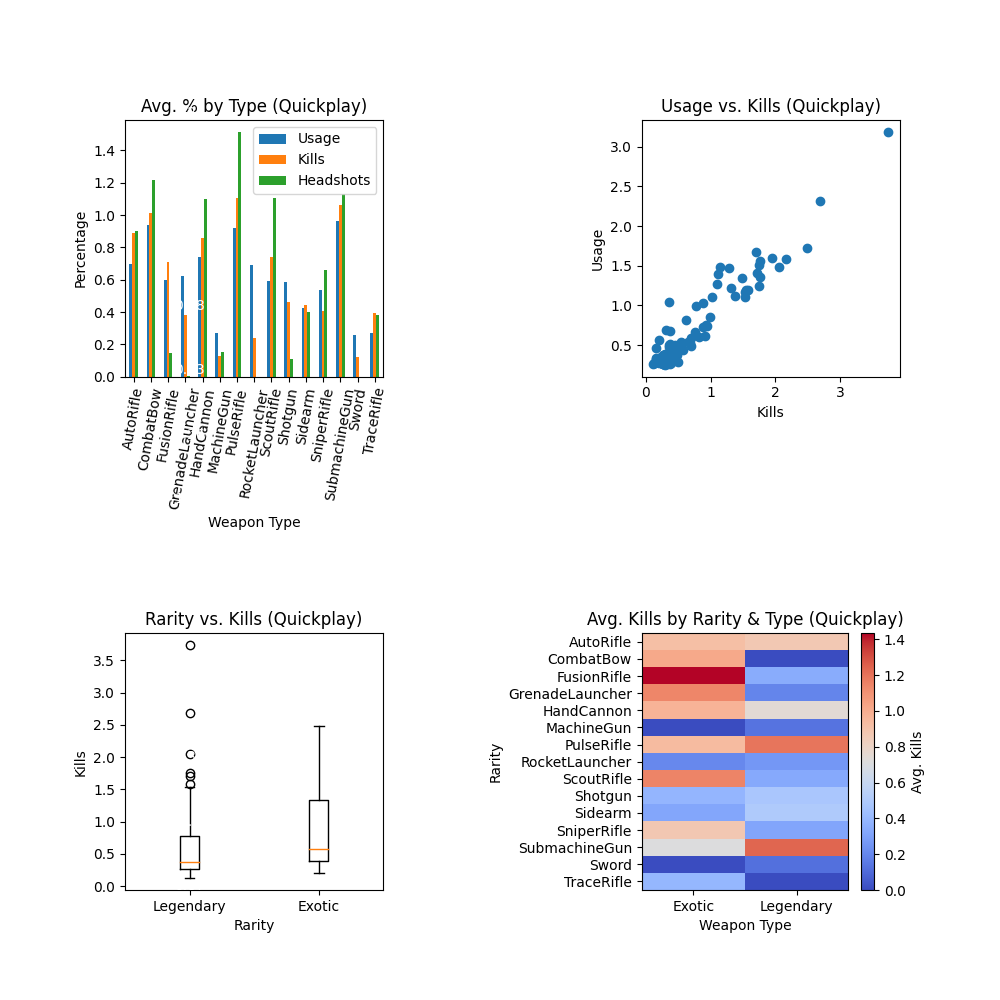
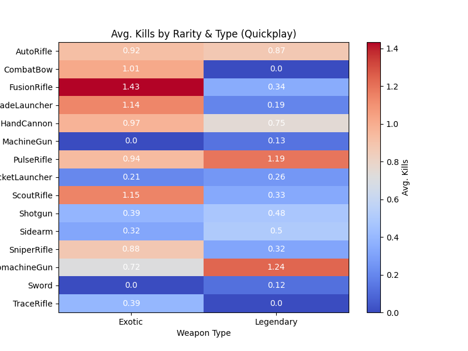
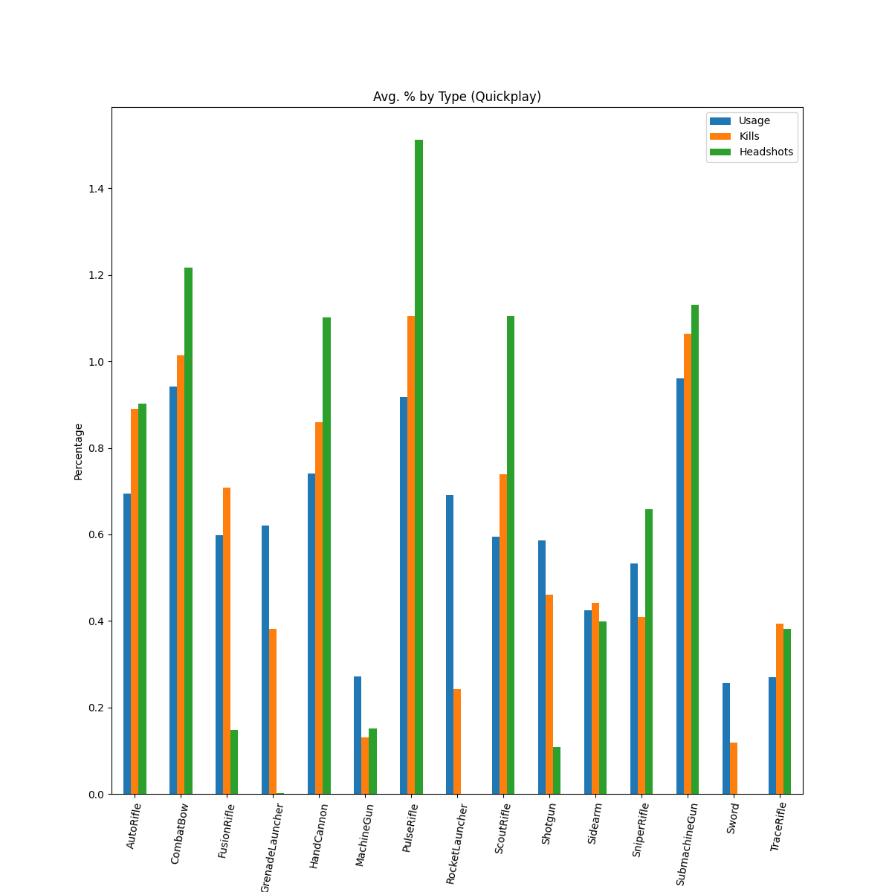
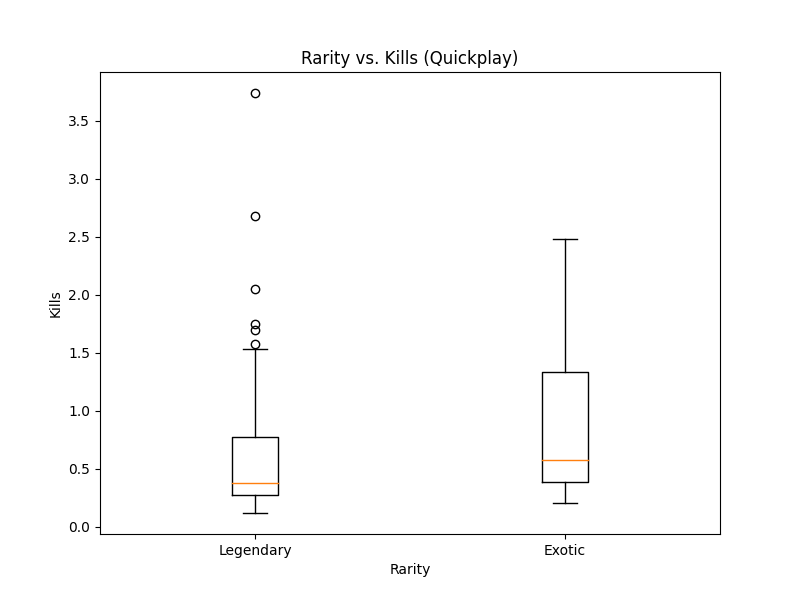
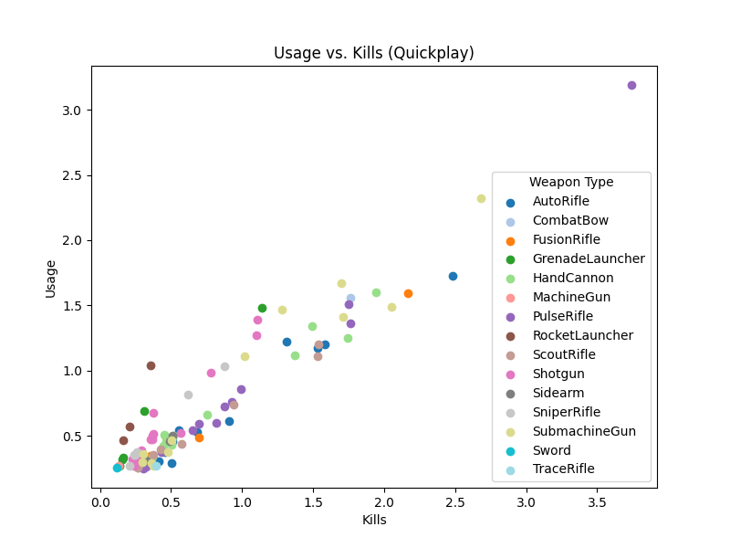

# D2 Gun Data Visualization
A data visualization for the FPS game Destiny 2 to investigate and assess balance of the most used guns in the PVP game modes.

## Competative

Here are all the the visualizations for Competative

A box plot for Average kills by rarity

## Quickplay

Here are all the the visualizations for Competative

A box plot for Average kills by rarity

