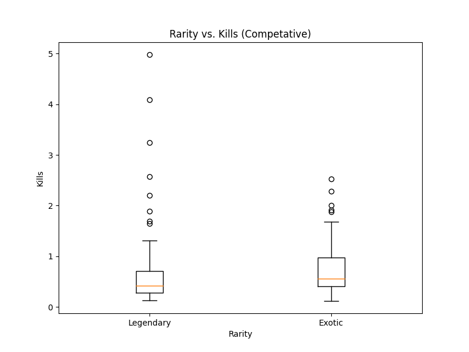

# D2 Gun Data Visualization
A data visualization for the FPS game Destiny 2 to investigate and assess balance of the most used guns in the PVP game modes.

## Competative
Here are all the the visualizations for Competative

A heat map for Average kills by rarity

We can clearly see that Exotic combat bows and sniper rifles are far superior to every other weapon class. However the usage is not showng and could paint a different picture.

A bar chart for average percentages by type of Weapon
Here we see that indeed the combat bow haw drastically more kills,headshots and usage than other weapon classes unlike sniper rifles who despite having more kills relative to all other weapon types second only to the combat bow it has a realtive tame usage percentage inline with other weapons. So we can infer that the combat bow is likely an outlier and needs rebalancing as it is being far more than other weapons and is getting more kills which indicates it is out of balance with other weapons.

A box plot for Kills by rarity
Here we can see that the mean kill percentage of exotics is greater that that of legendaries which one would expect as exotics are the rariest in the game and as such should have a reasonble level of power associated with them. However the outliers of the legendary set indicate that there are some legendary weapons that need retuning as they are vastly outperforming the exotics. 

A scatter plot for kills by usage for every weapon type
Here we can see that the guns used the most and getting the most kills appear to be submachine guns and hand cannons which paired with the other charts show that strongest weapon and therefore the out of balance weapon is likely a legendary sub machine gun.

## Quickplay
Here are all the the visualizations for Quickplay

A heat map for Average kills by rarity

Decidedly apart from Competative we can see with this heatmap that fusion rifles appear to be dominating in Quickplay at least in terms of average kills.

A bar chart for average percentages by type of Weapon

Here again we can see that the combat bows and sub machine guns seem to be doing far better relative to other weapons.

A box plot for Kills by rarity

Similarly to competative the legendaries in quickplay seem to have quite a few outliers where as exotics have none at all.

A scatter plot for kills by usage for every weapon type

Here again we can see that sub machine guns are absolutely dominating all other weapon types ensuring the conclusion that legendary submachine guns are something to investigate further as they show markers of being heavily favored over other weapon types

